<div id='top'></div>

<div class="toc-container">
<h3>Table of Contents — IHG Gemini Enterprise Day 1 Workshop</h3>
<ul>
  <li><a href="#section-1">Welcome, Prerequisites & Edition Quotas</a></li>
  <li><a href="#section-2">Task 1: Navigating the Interface & Basic Assistant Features</a></li>
  <li><a href="#section-3">Task 2: Configuring Personalization and Appearance</a></li>
  <li><a href="#section-4">Task 3: Web Search, File Analysis & Data Handling</a></li>
  <li><a href="#section-5">Task 4: Searching Internal Company Data (Enterprise Data Stores)</a></li>
  <li><a href="#section-6">Task 5: Using @ Mentions to Invoke Agents Directly</a></li>
  <li><a href="#section-7">Task 6: Strategic Brainstorming & Ideation with Gemini Chat</a></li>
  <li><a href="#section-8">Task 7: Conducting Deep Research</a></li>
  <li><a href="#section-9">Task 8: Generating Media (Images and Video)</a></li>
  <li><a href="#section-10">Task 9: Unlocking Insights with NotebookLM</a></li>
  <li><a href="#section-11">Task 10: Build an Agent from a Prompt with Agent Designer</a></li>
  <li><a href="#section-12">Task 11: Build an Agent with the Agent Designer Builder (Multi-Step Subagents)</a></li>
  <li><a href="#section-13">Task 12: Review Submitted Tasks</a></li>
  <li><a href="#section-14">Task 13: NotebookLM Challenge Labs</a></li>
</ul>
</div>

<br><br>

# Hands-on Lab: Unlocking Day 1 Value in Gemini Enterprise for IHG

**Last Modified**: July 2026  
**Target Audience**: IHG Employees (Hotel Operations, Guest Experience, Franchise Support, Marketing, HR, IT & Corporate Strategy)  
**Duration**: 2 Hours (Virtual Workshop)

---

<div id='section-1'></div>

# Welcome & Prerequisites

Welcome to the **Gemini Enterprise Hands-on Workshop** for InterContinental Hotels Group (IHG)!

Gemini Enterprise is Google Cloud’s premier AI assistant designed specifically for businesses. It provides secure, enterprise-grade access to Google's most capable AI models, seamlessly integrated with your organization's data ecosystem. Built from the ground up to prioritize data privacy and security, it ensures your sensitive corporate information remains protected within IHG's enterprise boundary.

In this session, you will explore the core day-one capabilities of the platform.

By leveraging Gemini Enterprise, IHG teams can drastically accelerate everyday workflows, synthesize complex information rapidly, and foster deeper creative problem-solving. From drafting guest recovery responses and analyzing hotel operations datasets to conducting deep market research and building custom workflow agents, Gemini acts as an intelligent collaborator across all departments.

### Workshop Environment & Data Bucket Setup
Before we begin, please ensure you are logged into your provided Google account and have navigated to the Gemini Enterprise landing page:
- **Data Connectors**: Your environment has already been pre-provisioned with sample enterprise data stores (including company financial profiles, customer feedback logs, and market research docs uploaded to Google Cloud Storage).
- **Sample Data Files**: All sample files used in this workshop are located in your local repository folder under [`data/ge_sample_data_for_workshop/`](data/ge_sample_data_for_workshop/).

> [!NOTE]
> **Enterprise Privacy Boundary**  
> Your prompts, uploaded files, and internal company search queries are strictly confidential and protected under enterprise security controls. They are **never used to train** public Google AI models.

<br>

### 📊 Gemini Enterprise Quota & Allocation Limits (Standard Edition)

IHG is provisioned on **Gemini Enterprise Standard Edition**. Feature quotas are **pooled across all licensed users** within your Google Cloud project and location:

| Feature / Product | Standard Edition Quota (Per User License) | Quota Pooling & Usage Behavior |
| :--- | :--- | :--- |
| **Assistant Queries** (Chat, Web Search, Code, File Uploads) | **160 queries / day** | Shared daily pool across all IHG project licenses |
| **Storage & Data Indexing** | **30 GiB / month** | Shared monthly pool across all project users |
| **Deep Research Agent** | **3 requests / day** | Shared daily pool across all project users |
| **Image Generation** (Imagen 3 / Create Images) | **5 images / day** | Shared daily pool across all project users |
| **Video Generation** (Veo 3.1 / Create Videos) | **2 videos / day** | Shared daily pool across all project users |
| **Agent Designer (Create & Publish)** | **1 agent / day** | Shared daily pool across all project users |
| **NotebookLM / Gemini Notebook** | Notebook Enterprise Limits | Shared pool across project users |

> [!IMPORTANT]
> **Understanding Quota Pooling**:  
> In Standard Edition, quotas do not hard-cap individual users. Instead, per-user limits are multiplied by total licensed users to create a **shared project pool**. For example, 50 licensed IHG users share a daily pool of **8,000 Assistant queries**, **150 Deep Research runs**, **250 Image generations**, and **100 Veo Video generations** per day. Power users can draw freely from this shared pool!

<br><br>

<div class="nav-link"><a href="#top">↑ Back to Top</a></div>

---

<div id='section-2'></div>

# Task 1: Navigating the Interface & Basic Assistant Features

Let's start by getting familiar with the Gemini Enterprise interface and foundational tools.

> [!NOTE]
> **Standard Edition Quota Note**: Assistant chat queries, local translations, and code generation draw from IHG's shared pool of **160 queries per user per day**.

1. **Introduce the Chat Assistant:**
   * In Gemini Enterprise, you can chat about web search results, enterprise data stores, and uploaded content. The assistant provides summaries, answers questions through natural language, and allows exporting answers to Docs, Sheets, or clipboard.

   <br>
   
   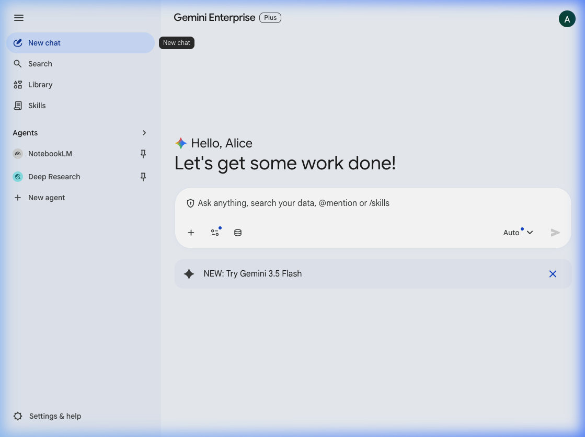

<br><br>

2. **Explore the Landing Page and Basic Prompts:**
   * On the main screen, locate the central **Omnibar (Prompt Input)** at the bottom.
   * Try submitting your first hospitality prompt:
     - Type: `Plan a 3-day team building retreat for 20 IHG corporate managers at an IHG resort property.`
     - Click **Submit** (or press Enter).

   <br>

   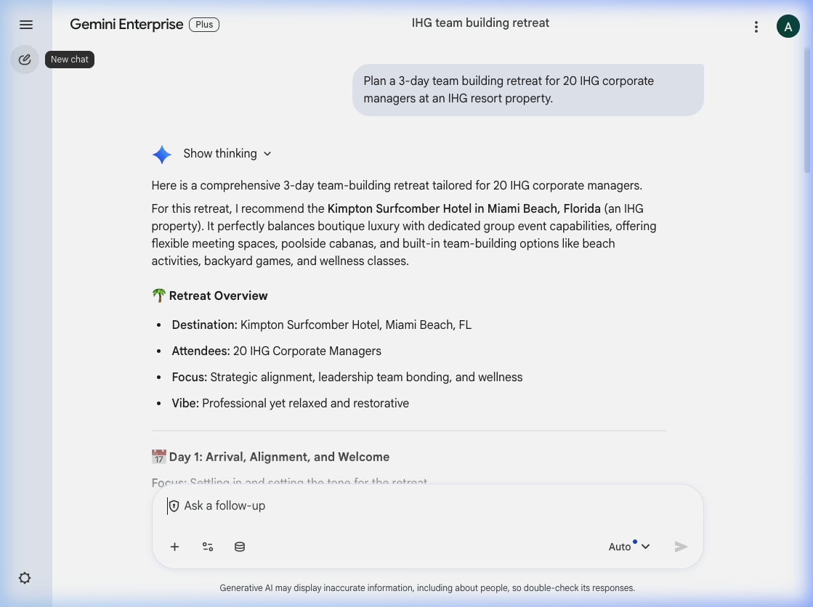

<br><br>

> [!NOTE]
> **Canvas Feature Note**: Gemini Enterprise may open Canvas view depending on the length and structure of the generated itinerary or plan. In some instances, the response will render directly within the standard chat stream, while in others it will automatically open in the expanded Canvas editor panel on the right side of the screen.

<br><br>

3. **Conversation History & Starred Chats:**
   * Look at the left navigation panel under **Chats**.
   * Your conversations are automatically stored under the **Chats** tab for 60 days.
   * You can "Star" your most useful conversations to keep them permanently in the **Starred** tab:
     - Click the **Star** icon on the top right of any conversation.

   <br>

   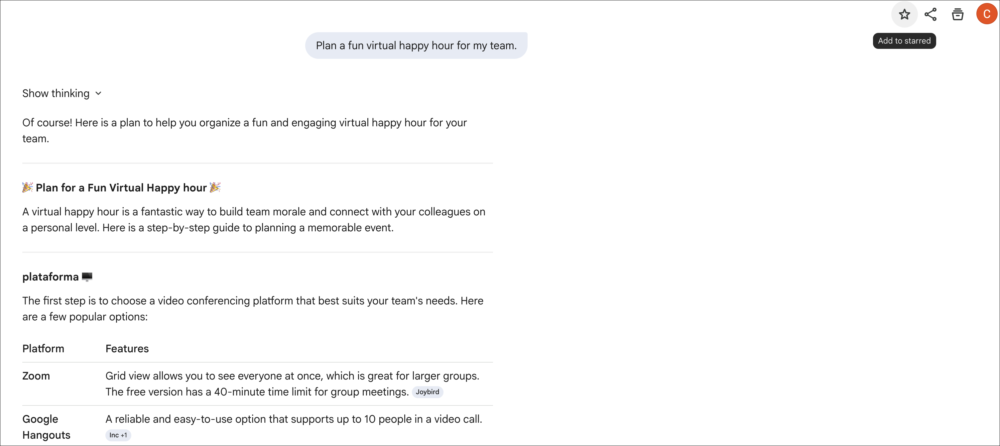

<br><br>

4. **Search Past Conversations:**
   * Click the **Search** icon on the left navigation sidebar.
   * Type `retreat`.
   * Notice it instantly finds past conversations containing that term.

   <br>

   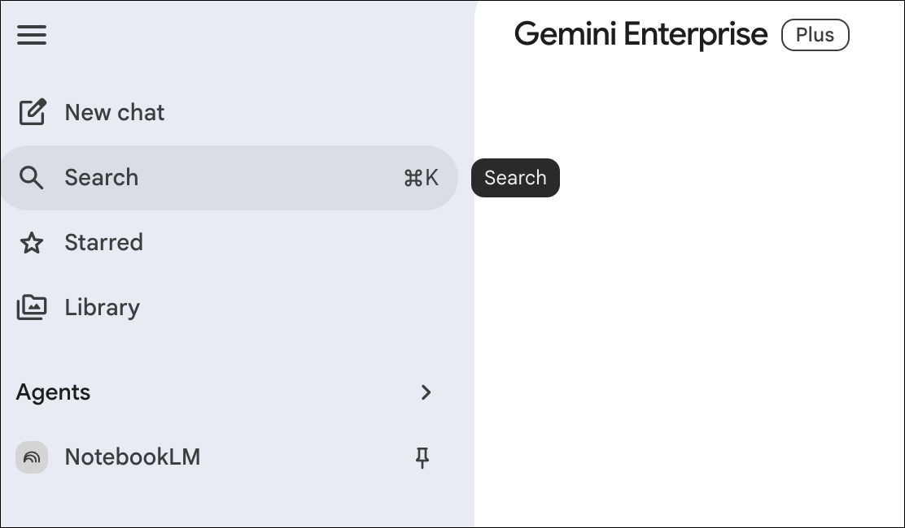

<br><br>

5. **Share a Conversation:**
   * To share your current chat, click the **Share** icon on the top right.
   * To share a previous conversation:
     - In the sidebar under **Chats**, hover over the conversation.
     - Click the **three dots** icon → **Share** → **Create link**. A shareable link is copied to your clipboard.

   <br>
   
   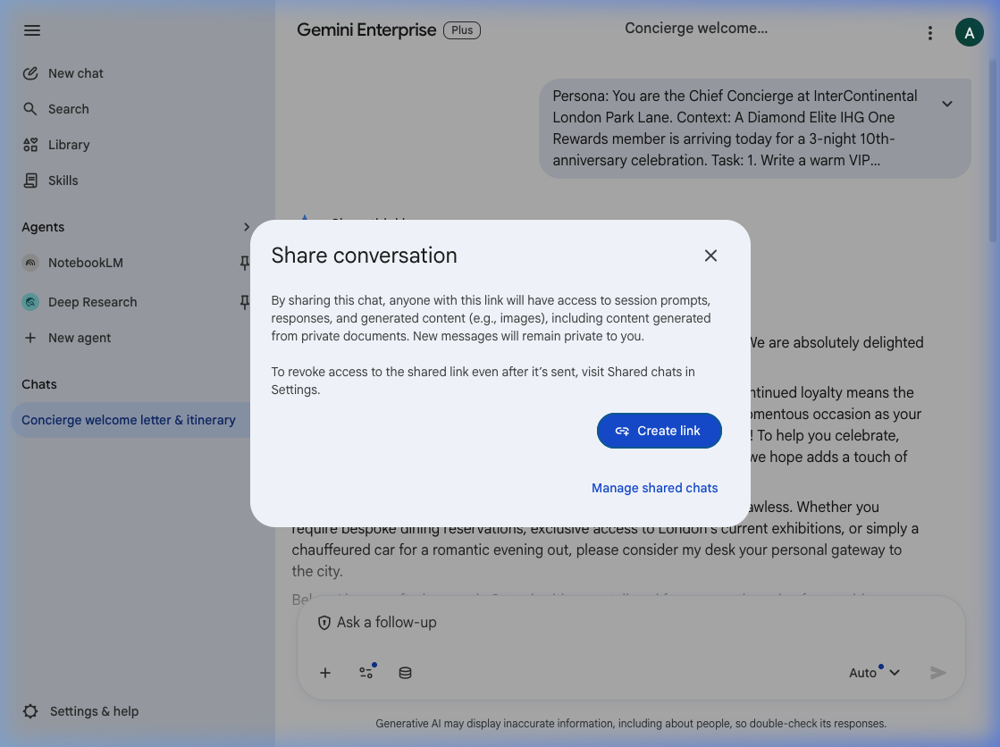

<br><br>

6. **View and Manage Shared Chats:**
   * Click **Settings & help** (gear icon) in the bottom left → **Shared chats**.
   * View details or revoke access to previously shared links.

   <br>

   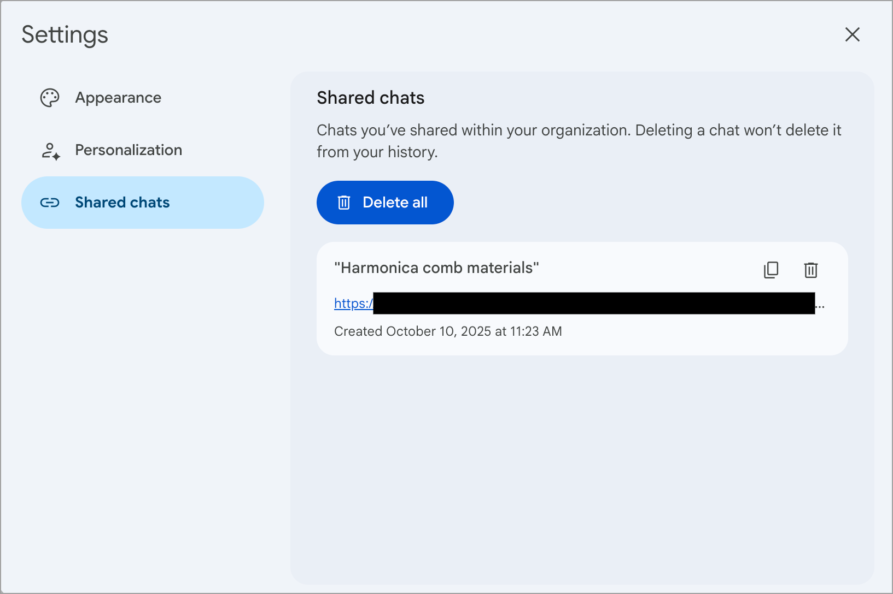

<br><br>

7. **Translation & Localized Messaging:**
   * Gemini Enterprise excels at international hospitality translation.
   * Click **New Chat** on the top-left sidebar.
   * In the fresh prompt area, enter:
     `Translate 'Welcome to InterContinental Hotels & Resorts. We are delighted to host your stay.' into Spanish, French, German, and Japanese.`

   <br>

   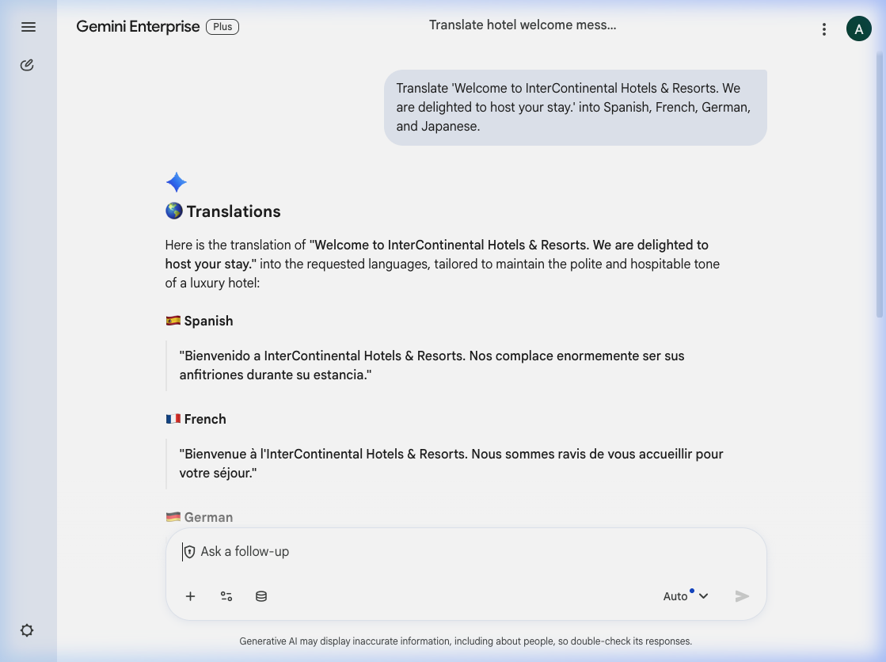

<br><br>

8. **Code & Formula Generation:**
   * Click **New Chat**.
   * Type: `Write a Python script to calculate RevPAR (Revenue Per Available Room) and ADR (Average Daily Rate) from a CSV file of daily hotel metrics.`
   * Notice options to click **Show code** and copy code snippets.

   <br>

   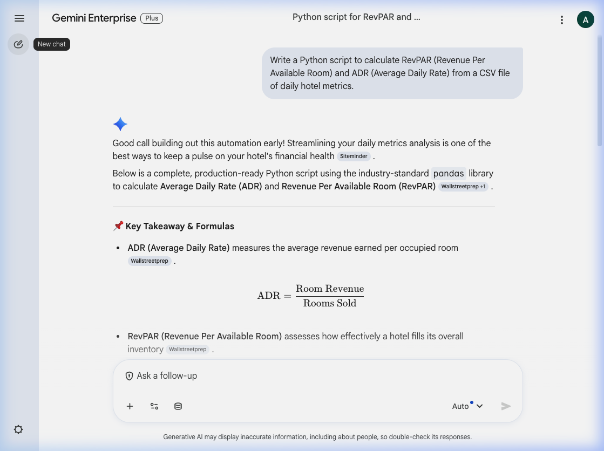

<br><br>

<div class="nav-link"><a href="#top">↑ Back to Top</a></div>

---

<div id='section-3'></div>

# Task 2: Configuring Personalization and Appearance

**Appearance**: Customize the theme (System, Light, Dark) and chat density under Settings.

**Personalization**: Gemini Enterprise builds memory understanding your individual role and work context for tailored responses.

1. **Navigate to Settings:**
   * Click **Settings & help** (gear icon at bottom left) → **Personalization**.

<br><br>

2. **Edit your Profile:**
   * Enter your details:
     - **Preferred name**: `Alice` (or your preferred name)
     - **Your role or job title**: `Guest Relations Manager`
     - **Your industry**: Select **`Custom`** from the dropdown menu, then enter: `Industry: Hospitality & Hotel Operations`

   <br>

   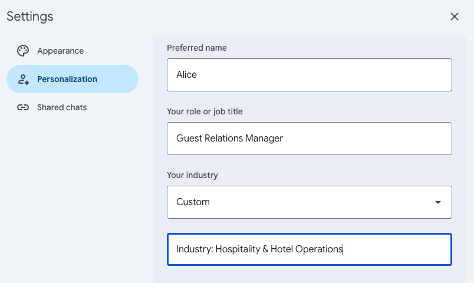

<br><br>

3. **Enable Memory & History:**
   * Ensure toggles are ON: **Conversation history** and **Reference saved memories**.

   <br>

   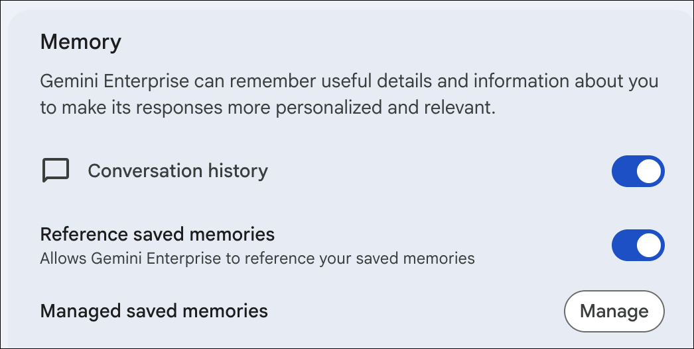

<br><br>

4. **Appearance:**
   * Under Settings, click **Appearance** to toggle between Light and Dark mode.

   <br>

   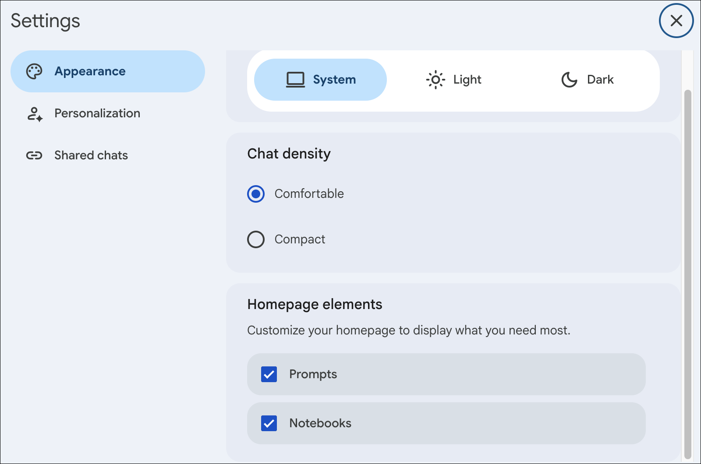

<br><br>

> [!TIP]
> **Expected Result**: Gemini now tailors default responses using hospitality terminology (e.g., *RevPAR, ADR, Occupancy, Guest Satisfaction Score, IHG One Rewards*) suited to your role.

<br><br>

<div class="nav-link"><a href="#top">↑ Back to Top</a></div>

---

<div id='section-4'></div>

# Task 3: Web Search, File Analysis & Data Handling

Gemini Enterprise can analyze public web data, process files, and format data for export.

> [!NOTE]
> **Standard Edition Quota Note**: Grounded Google Search queries and document uploads draw from IHG's shared pool of **160 Assistant queries per user per day**.

1. **Enable Google Search:**
   * In the Omnibar, click the **Tools** icon and ensure **Google Search** is enabled.

2. **Search the Web:**
   * Click **New Chat**.
   * In the Omnibar, type: `What are the key hospitality industry trends impacting luxury hotel brands like InterContinental Hotels & Resorts in 2026?`

   <br>

   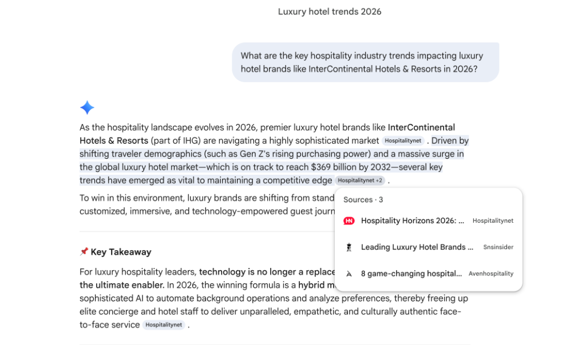

<br><br>

3. **Check Sources & Citations:**
   * Notice hyperlinked reference citations within generated answers. Click on the **Sources** popover (e.g., `Sources · 3`) to view the exact public website articles used to ground the answer.

   <br>

   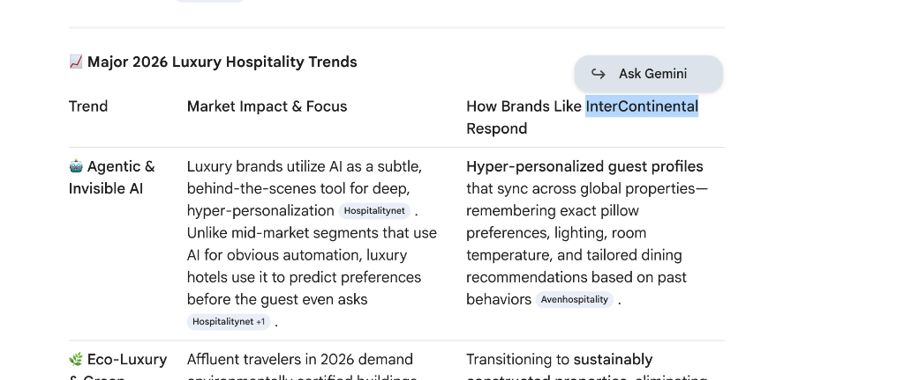

<br><br>

4. **Follow-Up Questions via Text Highlighting:**
   * Highlight a specific word or phrase in the generated answer (e.g., `InterContinental`).
   * A floating **Ask Gemini** tooltip will appear above the highlighted text.
   * Type your follow-up query: `Tell me more about their loyalty program positioning`, and submit.

   <br>

   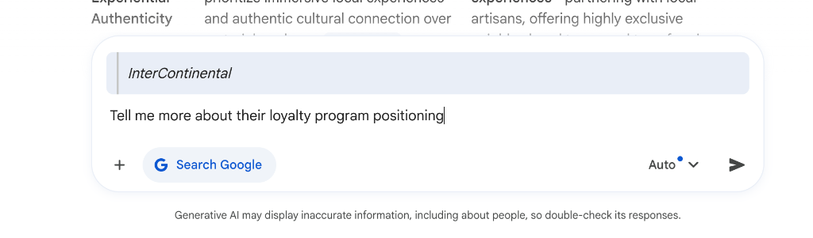

<br><br>

5. **Analyze Concepts and Hospitality Methodologies:**
   * Start a **New Chat**.
   * Type: `My objective is to understand modern revenue management methodologies in hospitality. Please summarize key forecasting models used to optimize hotel room pricing during peak vs off-peak seasons.`

<br><br>

6. **Brainstorm New Content Outline:**
   * Start a **New Chat**.
   * Type: `Give me a 5-point outline for an email newsletter promoting summer double-points rewards for IHG One Rewards members. Target audience: frequent business travelers.`

<br><br>

7. **File Analysis (PDF Upload):**
   * Sample File Location: [`data/ge_sample_data_for_workshop/microservices.pdf`](data/ge_sample_data_for_workshop/microservices.pdf).
   * Click **New Chat**.
   * Drag and drop the PDF into the Omnibar (or click **+** upload icon).
   * Type: `What is this about and how do these architectural concepts apply to modern hotel Property Management Systems (PMS)?`

   <br>

   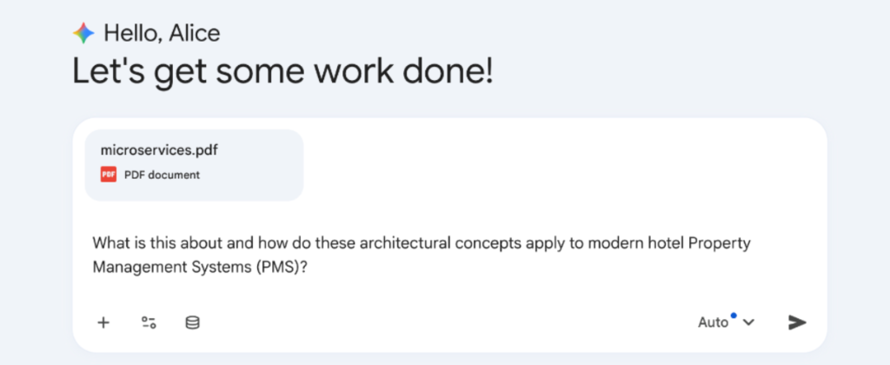

<br><br>

8. **Download Tabular Data (IHG Property Performance Comparison):**
   * Start a **New Chat**.
   * Type: `Create a detailed table comparing 5 hypothetical IHG properties (InterContinental London, Kimpton Epic Miami, Crowne Plaza Chicago, Holiday Inn Express Nashville, Hotel Indigo Atlanta) with columns for Brand Segment, ADR ($), Occupancy Rate (%), RevPAR ($), and Guest Satisfaction Score.`
   * Bottom right of table: Click **Copy** or **Download Table / Export to Sheets**.

   <br>
   
   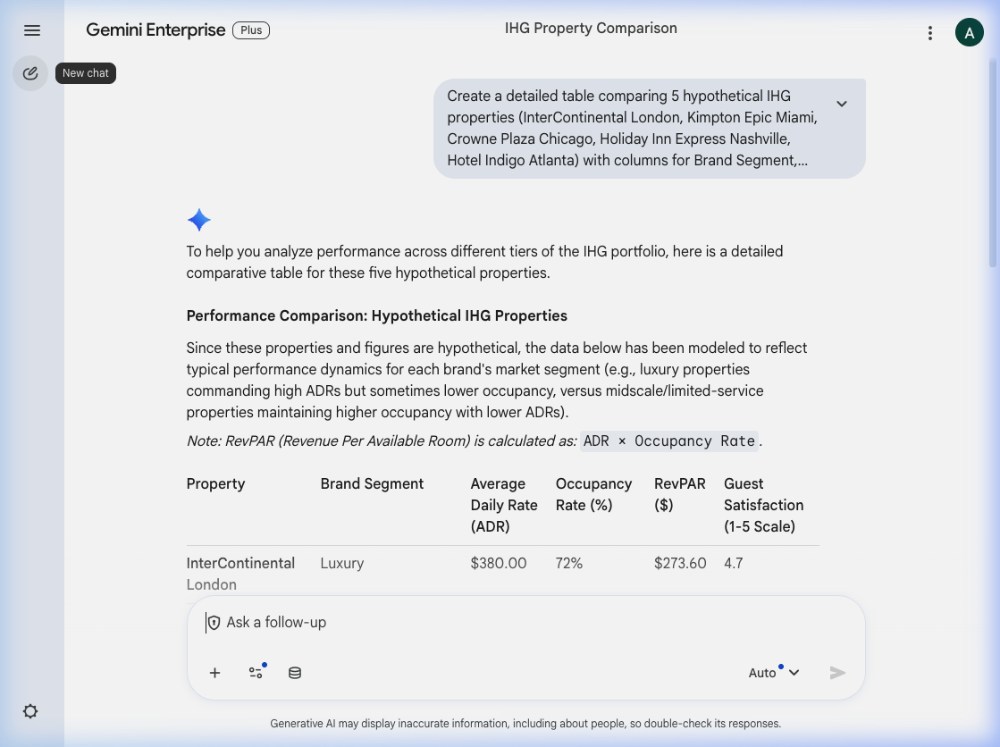

<br><br>

9. **Graph & Chart Generation from CSV:**
   * Sample File Location: [`data/ge_sample_data_for_workshop/sales_performance.txt`](data/ge_sample_data_for_workshop/sales_performance.txt) (save as `.csv`).
   * Start a **New Chat** and upload the file.
   * Type: `Create a pie chart of top 5 revenue states/properties and combine the rest into Others.`

   <br>

   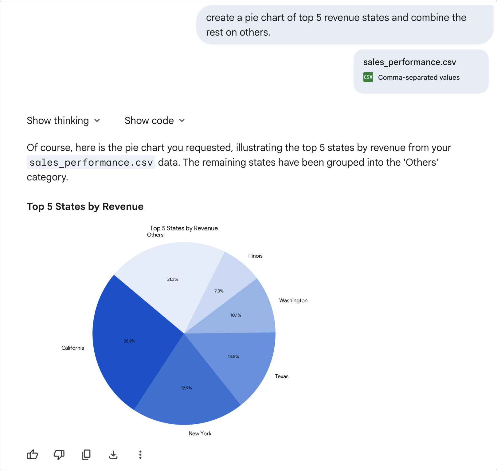

<br><br>

<div class="nav-link"><a href="#top">↑ Back to Top</a></div>

---

<div id='section-5'></div>

# Task 4: Searching Internal Company Data (Enterprise Data Stores)

Gemini Enterprise securely queries enterprise connectors (Google Cloud Storage, Drive, BigQuery, SharePoint, ServiceNow). Your environment has pre-indexed company data stores.

> [!NOTE]
> **Standard Edition Quota Note**: Internal enterprise search indexing and data storage draw from IHG's shared project limit of **30 GiB per user per month**.

1. Click **New Chat**.
2. Click **Tools** → Select **Search Company Data** (or `@Company data`).
3. **Configure Connectors**: Click the database/connectors icon inside the **Company data** pill. 
   - **Toggle OFF** all other search tools (such as Google Search and external 3rd-party connectors).
   - **Toggle ON** strictly **Cloud Storage** (where the pre-uploaded workshop sample dataset is stored).

   > [!IMPORTANT]
   > **Connector Configuration Note**: It is critical to disable all other connectors and Google Search during this exercise so Gemini Enterprise searches exclusively within your pre-uploaded Cloud Storage bucket. If Google Search or other connectors remain active, Gemini may retrieve general internet or external system answers instead of grounding strictly in your lab's sample data store.

   <br>

   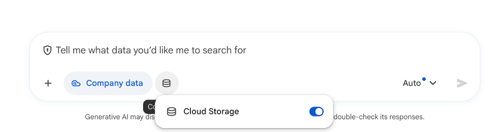

<br><br>

4. Enter prompt: `Who is the CEO of Cymbal Bank?` (or query your connected company data store).

   <br>

   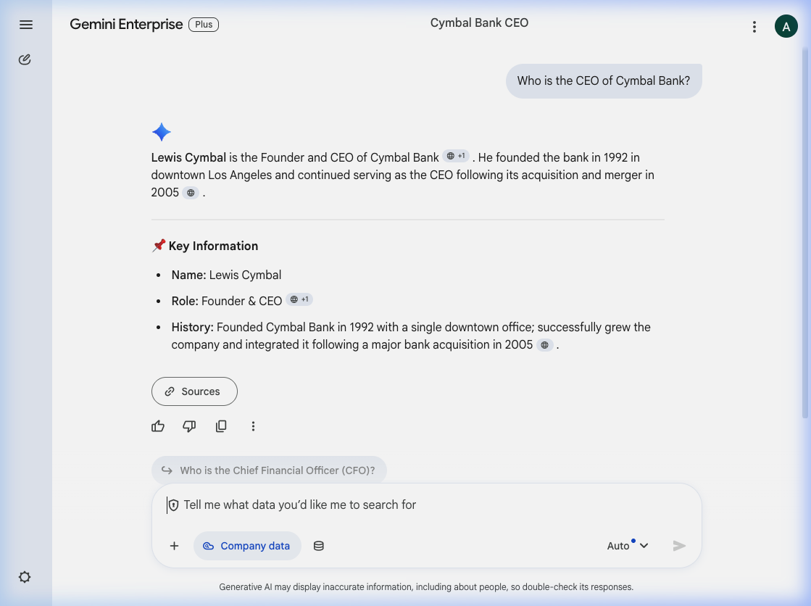

<br><br>

5. Review synthesized answer grounded directly in internal company files with citations.

   <br>

   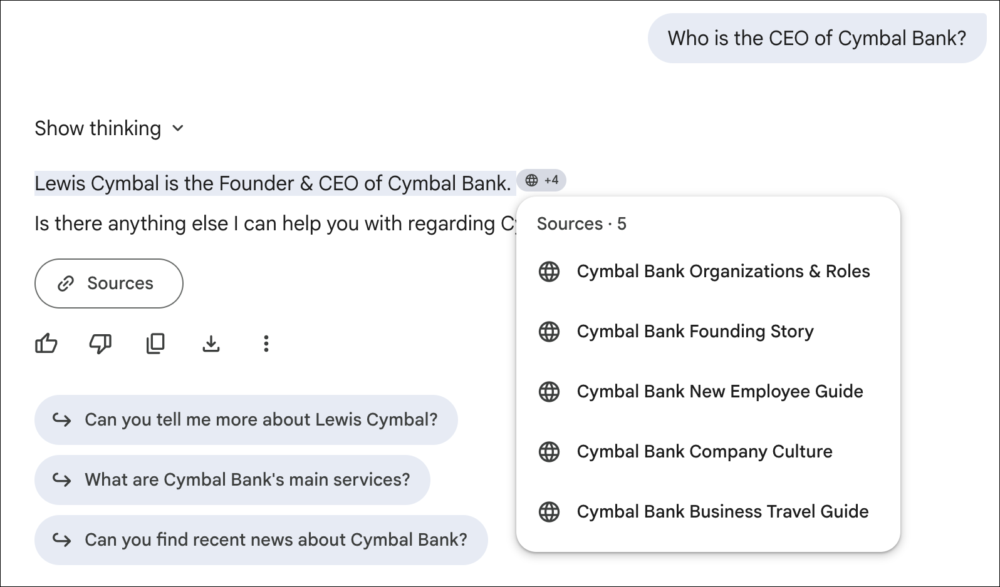

<br><br>

6. Click **New Chat** → Ensure **Search Company Data** is active (with only **Cloud Storage** enabled).
7. Enter prompt: `Summarize the customer sentiment pie chart from our uploaded hotel operational reports.`
8. Observe how Gemini interprets visual and text data from internal enterprise files.

   <br>

   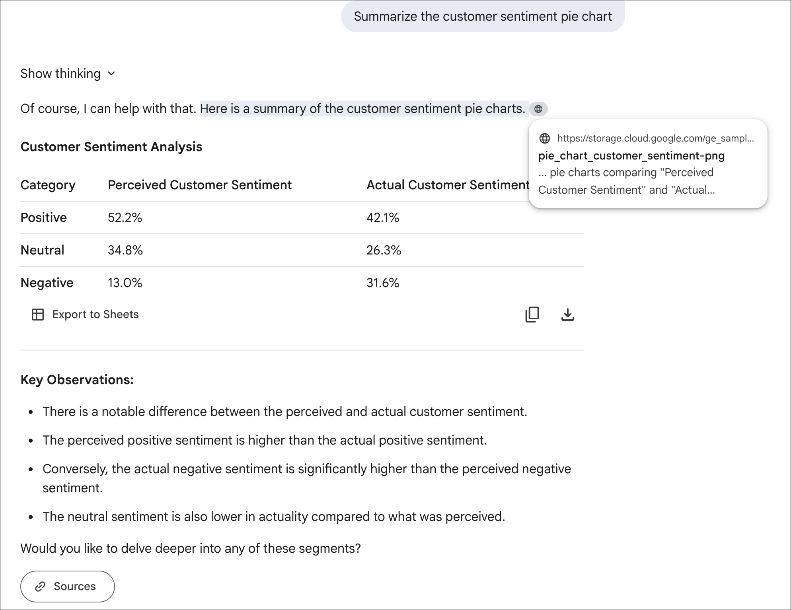

<br><br>

<div class="nav-link"><a href="#top">↑ Back to Top</a></div>

---

<div id='section-6'></div>

# Task 5: Using @ Mentions to Invoke Agents Directly

In Gemini Enterprise, typing **`@`** in the Omnibar opens an interactive shortcut menu specifically for invoking **Agents** (such as *Deep Research*, *Data Insights Agent*, or custom published agents).

> [!NOTE]
> **Standard Edition Quota Note**: Invoking `@Deep Research` draws from IHG's shared pool of **3 Deep Research requests per user per day**.

1. Click **New Chat**.
2. In the central Omnibar, type **`@`**.
3. Observe the pop-up menu displaying the **Agents** list (`Deep Research`, `Data Insights Agent`, etc.).

   <br>

   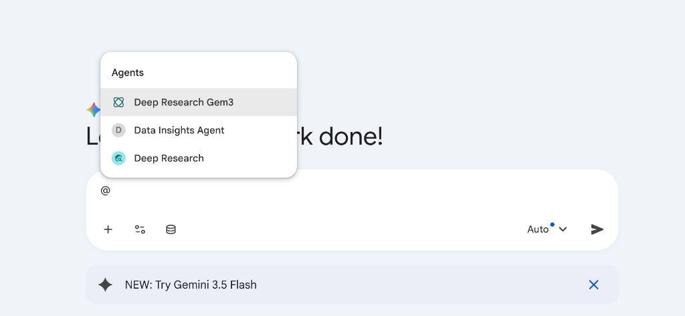

<br><br>

4. Select **`@Deep Research`** (or type `@Deep Research`).

   > [!NOTE]
   > **UI Distinction**: The `@` symbol is reserved exclusively for invoking **Agents**. Data sources (such as *Company data*) and grounding features (such as *Google Search*) are managed via the **Tools** icon (`+` / sliders / database icons) at the bottom left of the Omnibar.

5. Observe how typing `@` allows you to seamlessly invoke specialized agents directly within an active chat prompt without navigating through sidebar menus.

<br><br>

<div class="nav-link"><a href="#top">↑ Back to Top</a></div>

---

<div id='section-7'></div>

# Task 6: Strategic Brainstorming & Ideation with Gemini Chat

Explore creative options, campaign angles, and multi-option evaluations using structured ideation prompts in Gemini Chat.

1. Start a **New Chat**.
2. Type: `Persona: You are a Hospitality Innovation Consultant. Task: Brainstorm 5 creative gamification ideas to increase IHG One Rewards app engagement among Gen Z travelers. Evaluate each idea on Feasibility (1-10), Guest Value (1-10), and Brand Alignment.`

   <br>

   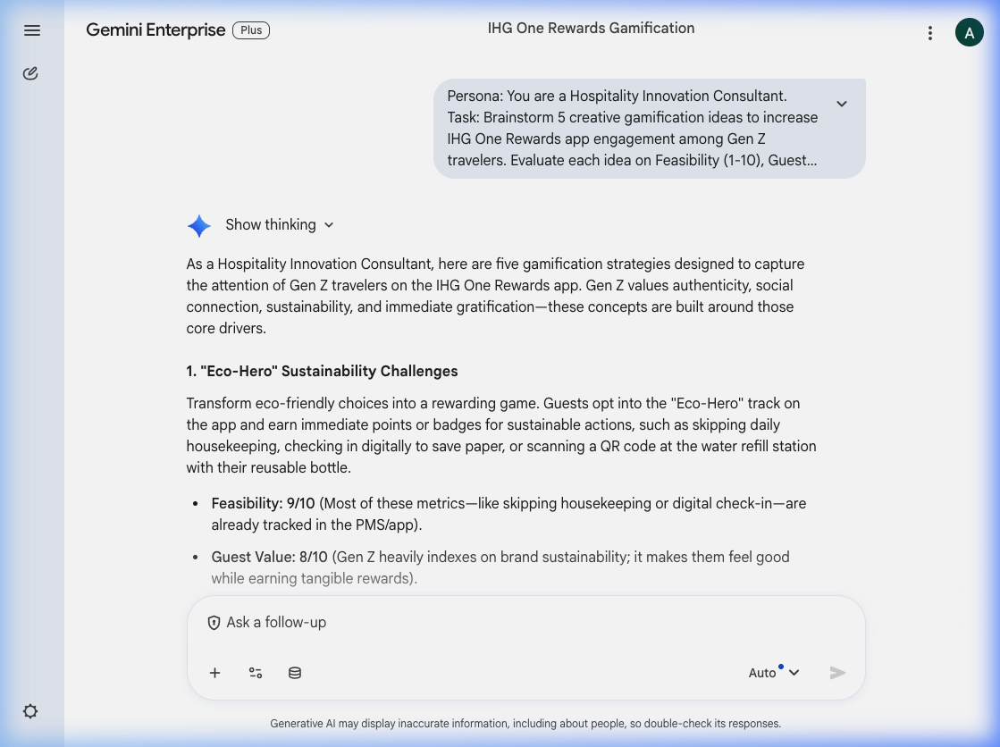

<br><br>

3. Review the multi-angle evaluation table generated.

<br><br>

<div class="nav-link"><a href="#top">↑ Back to Top</a></div>

---

<div id='section-8'></div>

# Task 7: Conducting Deep Research

The **Deep Research** agent performs extensive multi-step web and company search to build multi-page reports with citations.

> [!NOTE]
> **Standard Edition Quota Note**: Each Deep Research run draws from IHG's shared project pool of **3 Deep Research executions per user per day**.

1. On the left sidebar under **Agents**, select **Deep Research**.

   <br>

   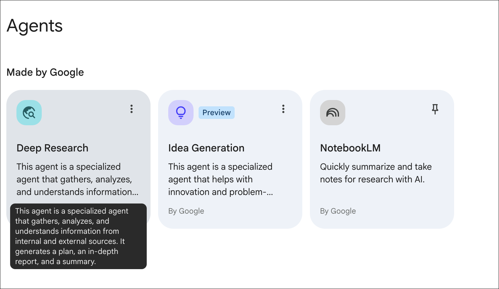

<br><br>

2. **Choose your Research Scenario**: Select **one** of the two hospitality research topics below to submit:

   - **Option 1 (Hotel Technology & AI Automation)**:
     ```text
     The impact of AI on hotel guest satisfaction and customer service automation.
     ```

   - **Option 2 (IHG Loyalty & Brand Strategy)**:
     ```text
     Compare the effectiveness of different marketing and loyalty strategies for IHG luxury brands (InterContinental, Regent, Kimpton) vs IHG essential brands (Holiday Inn, Holiday Inn Express).
     ```

   <br>

   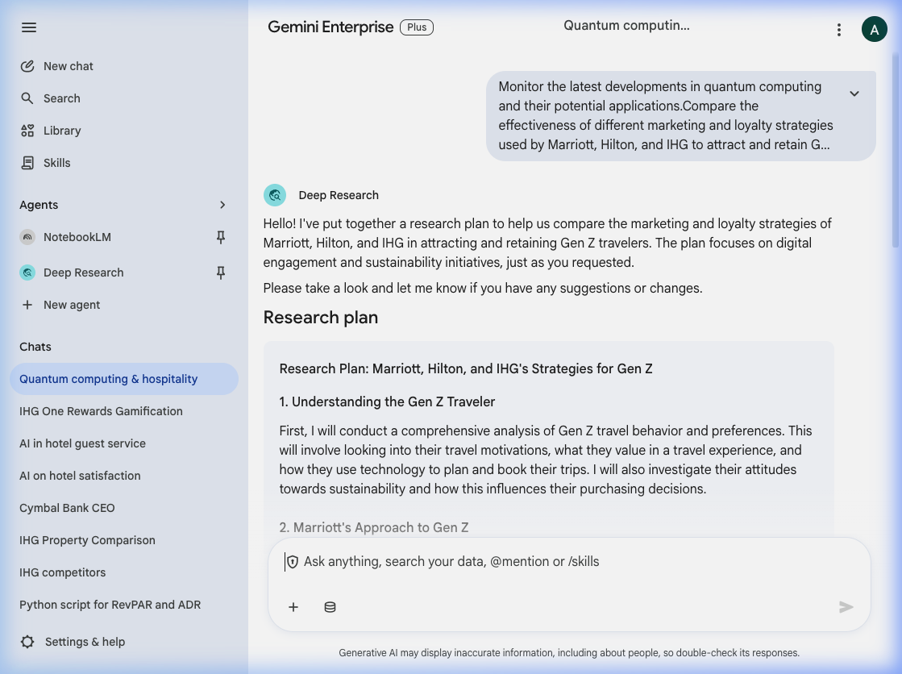

<br><br>

3. **Review & Trigger Research Plan**: Review the generated research plan, edit topics if desired, and click **Start Research**.
4. **Asynchronous Execution**:

   > [!NOTE]
   > **Asynchronous Execution**: Once you click **Start Research**, Deep Research performs multi-step web and document synthesis in the background. Because this comprehensive research process takes several minutes to complete, **proceed directly to the next task now**. We will return to review your completed report in **Task 12: Review Submitted Tasks**.

   <br>

   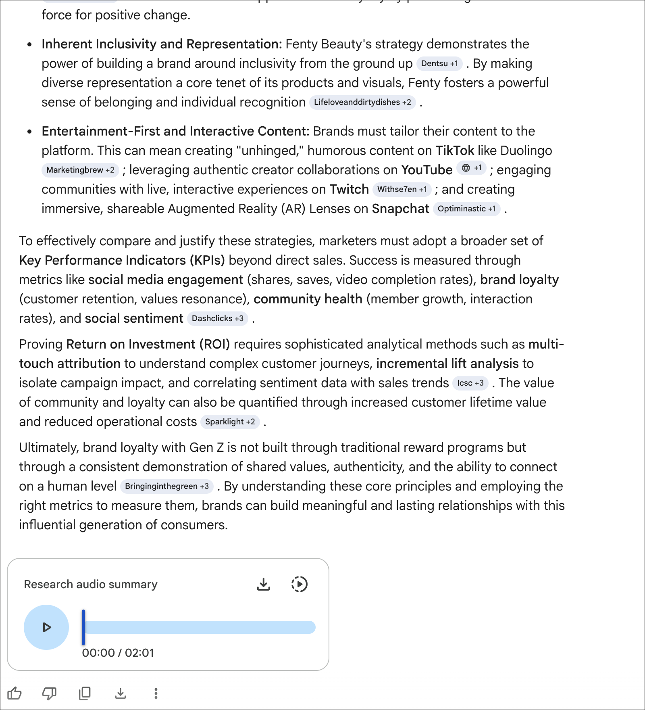

<br><br>

<div class="nav-link"><a href="#top">↑ Back to Top</a></div>

---

<div id='section-9'></div>

# Task 8: Generating Media (Images and Video)

### Part A: Text-to-Image Generation

> [!NOTE]
> **Standard Edition Quota Note**: Image generation draws from IHG's shared project pool of **5 images per user per day**.

1. Click **New Chat** → Click the **Tools** icon (`+` / sliders icon) → Select **Create images** (Image Generator tool).

   <br>

   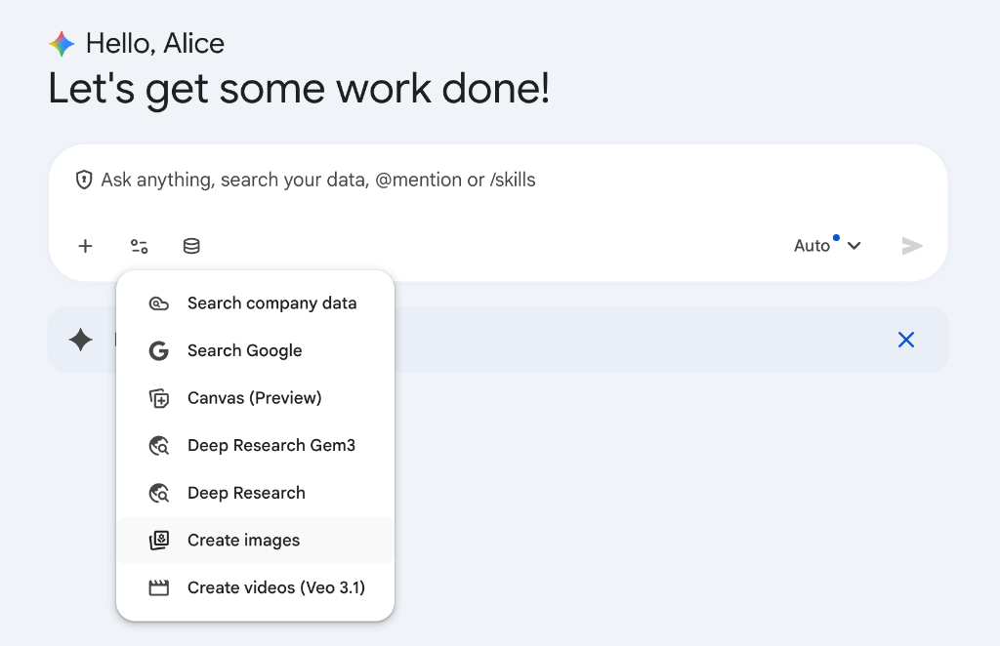

<br><br>

2. Enter prompt: `Generate a high-resolution promotional website banner for a luxury InterContinental beach resort in Bali at sunset, showing modern infinity pool and palm trees.`

   <br>

   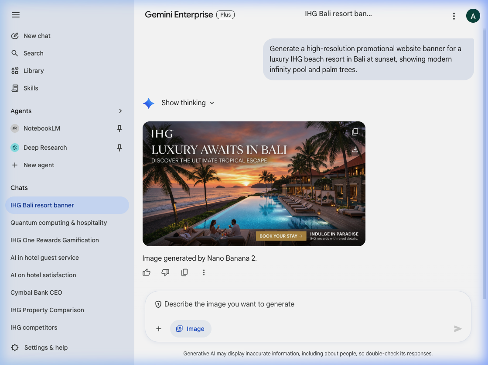

<br><br>

3. Download or copy the generated image (Click **Yes, download** on the enterprise data exfiltration warning dialog if prompted).

   <br>

   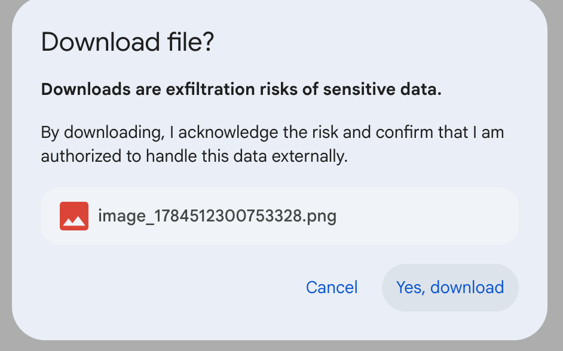

<br><br>

> [!TIP]
> **🎨 Pro Tip for Creative & Brand Teams (Advanced Photography Prompting)**  
> Try this cinema-grade photography prompt to amaze your brand designers:
> ```text
> Photorealistic 8k architectural photograph of an overwater bungalow villa at InterContinental Bora Bora Resort at sunset. Warm golden hour lighting casting long soft shadows across polished teak wood decking. Modern infinity pool blending into turquoise lagoon waters. Shallow depth of field, f/2.8 lens aperture, 35mm Hasselblad camera perspective, cinematic color grading with rich blue and warm orange tones, high detail on water ripples and palm leaf texture.
> ```

<br><br>

### Part B: Multimodal Image Generation (Infographic from PDF)
1. Download sample file: [`data/ge_sample_data_for_workshop/acme-co/Web Design RFP.pdf`](data/ge_sample_data_for_workshop/acme-co/Web%20Design%20RFP.pdf).
2. Start **New Chat**, click **+**, upload PDF.
3. Select **Image Generator** tool (**Create images**).
4. Type: `Create an infographic timeline based on the key dates and milestones in this RFP document.`

   <br>

   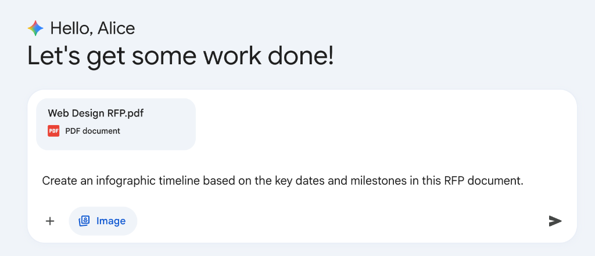

<br><br>

   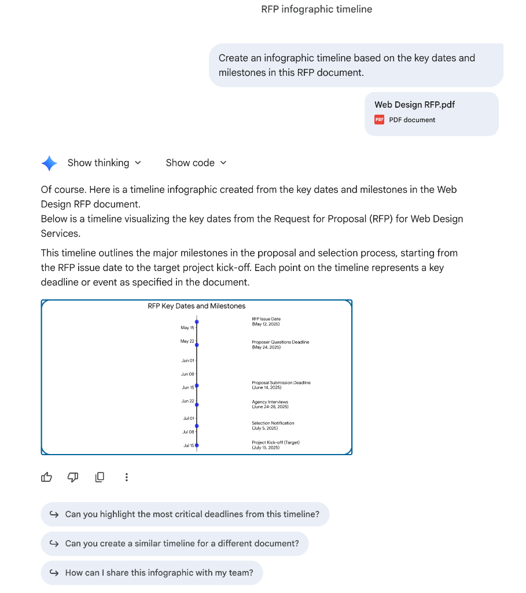

<br><br>

### Part C: Video Generation with Veo

> [!NOTE]
> **Standard Edition Quota Note**: Veo 3.1 video generation draws from IHG's shared project pool of **2 video generation requests per user per day**.

1. Click **New Chat** → Click the **Tools** icon (`+` / sliders icon) → Select **Generate videos with Veo** tool (**Create videos (Veo 3.1)**).

   <br>

   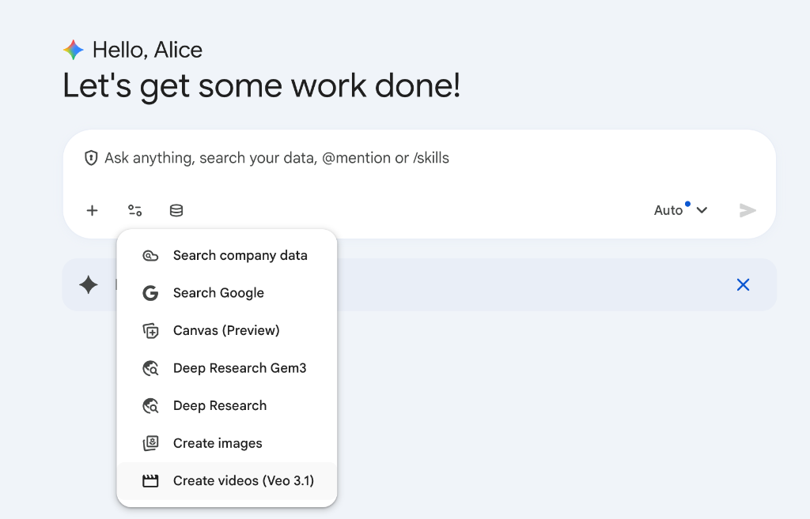

<br><br>

2. Enter prompt: `A cinematic time-lapse of a bustling luxury hotel lobby at dusk, warm lighting, elegant chandelier, guests arriving, smooth camera motion.`

   <br>

   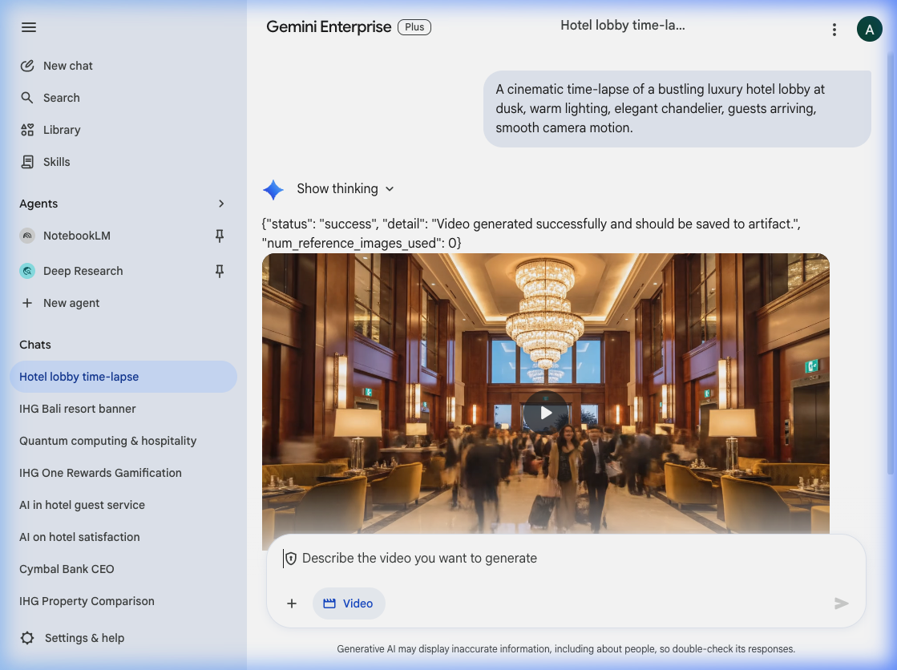

<br><br>

3. Download the generated 8-second video.

<br><br>

> [!TIP]
> **🎬 Official Veo 3.1 Directing Formula (Google Cloud & DeepMind Prompting Standard)**  
> Apply the official 5-part formula for direct Hollywood-style control:  
> **`[Cinematography] + [Subject] + [Action] + [Context] + [Style, Ambiance & Audio]`**
>
> **Advanced Timestamp Directing `[00:00-00:08]`**: You can direct multi-shot sequences with precise Pacing & Audio SFX in a single prompt:
> ```text
> [00:00-00:02] Wide high-angle drone tracking shot gliding over an overwater bungalow at InterContinental Bora Bora during golden hour. Warm sunlight reflecting on calm turquoise lagoon waters. SFX: soft ocean breeze, gentle waves lapping.
>
> [00:02-00:05] Medium shot of a well-dressed couple sitting on private deck loungers, smiling as a butler serves fresh tropical cocktails. Ambient noise: light acoustic guitar playing in the background.
>
> [00:05-00:08] Macro slow-motion close-up of a fresh hibiscus flower floating in the resort infinity pool with water ripples reflecting the setting sun. Shallow depth of field, 4k cinematic resolution, filmic color grade.
> ```

<br><br>

<div class="nav-link"><a href="#top">↑ Back to Top</a></div>

---

<div id='section-10'></div>

# Task 9: Unlocking Insights with NotebookLM

**NotebookLM** provides document-grounded research with inline citations, mind maps, and podcast-style Audio/Video Overviews.

1. Left sidebar → **Agents** → **NotebookLM**.

   <br>
   
   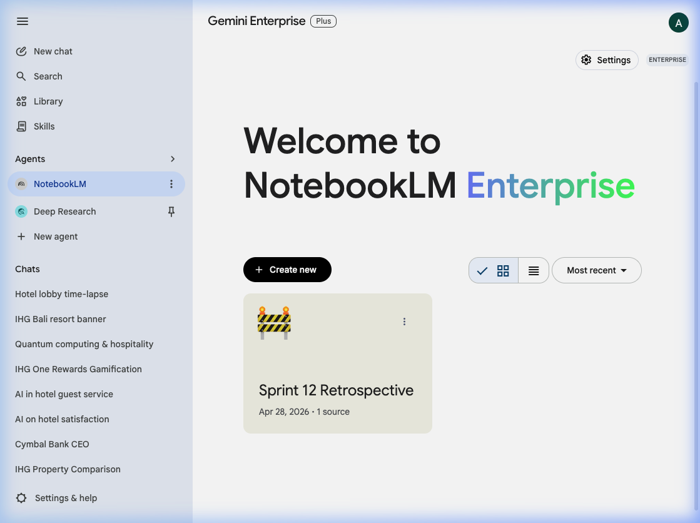

<br><br>

2. Click **Create a new Notebook** (Title: `IHG Brand Expansion & Vendor Analysis`).

   <br>

   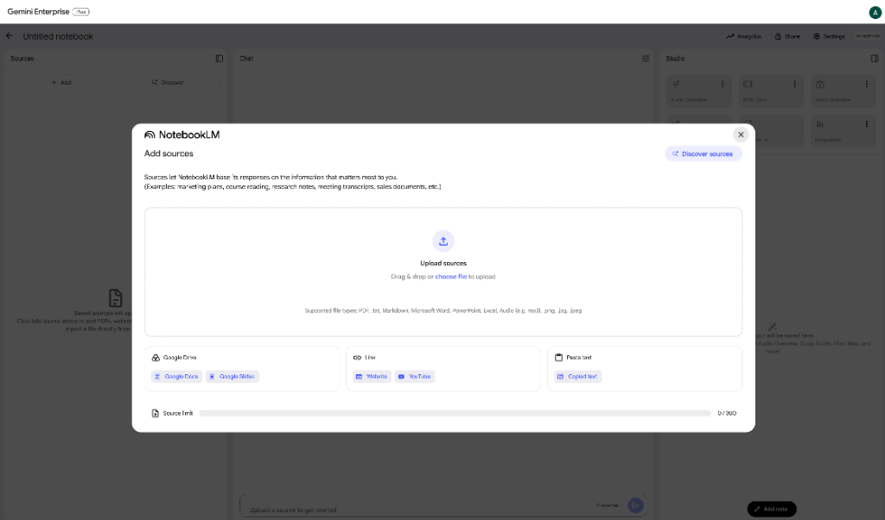

<br><br>

3. Import sample files located in:
   - [`data/ge_sample_data_for_workshop/acme-co/Web Company's Product Capabilities.pdf`](data/ge_sample_data_for_workshop/acme-co/Web%20Company's%20Product%20Capabilities.pdf)
   - [`data/ge_sample_data_for_workshop/acme-co/Web Design RFP.pdf`](data/ge_sample_data_for_workshop/acme-co/Web%20Design%20RFP.pdf)

   <br>

   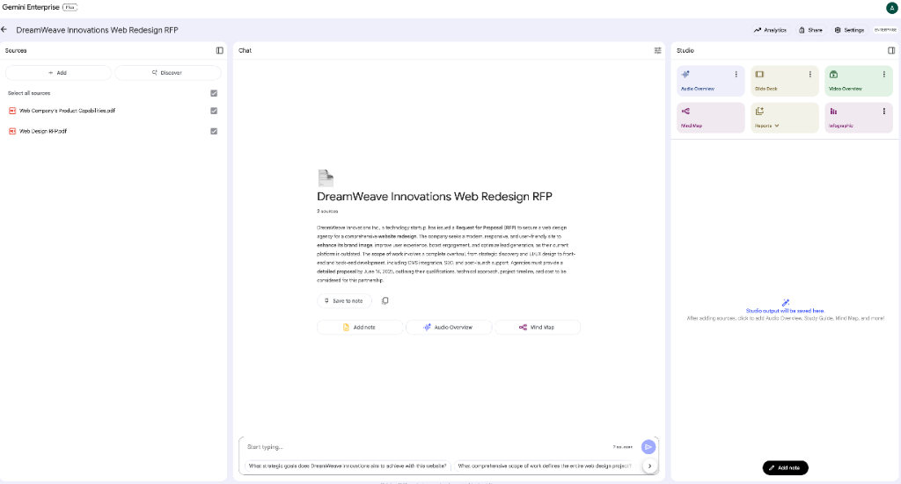

<br><br>

4. Chat query: `Summarize key requirements, evaluation criteria, and deadlines from the RFP.`
5. Click inline citation numbers to verify exact source passages.

   <br>

   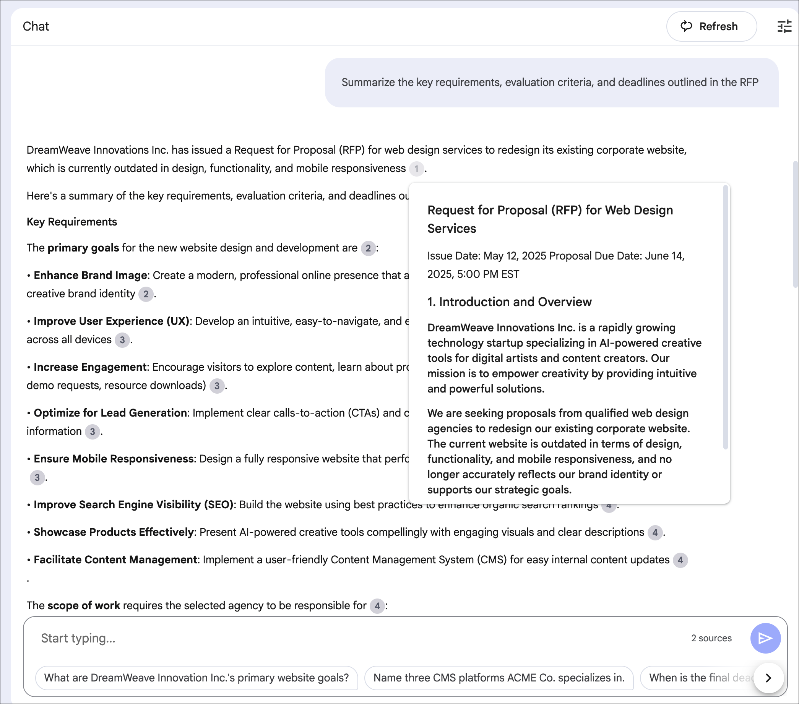

<br><br>

6. Generate **Mind Map**.

   <br>

   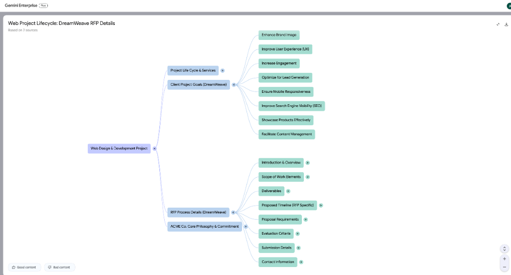

<br><br>

7. **Audio Overview**: Right panel → Audio Overview → Customize → Type `Focus on how vendor capabilities support hotel franchise onboarding` → Click **Generate**.

   <br>

   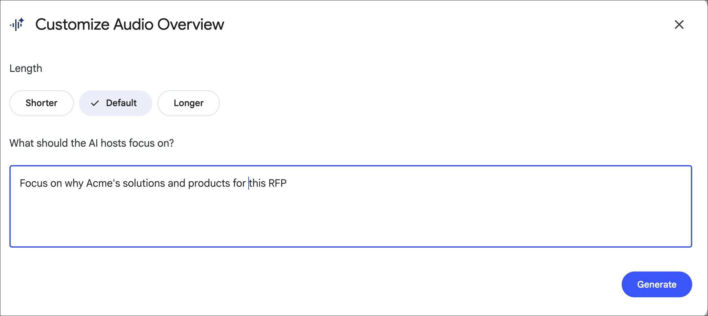

<br><br>

8. **Video Overview**: Customize video focus and generate.

   <br>

   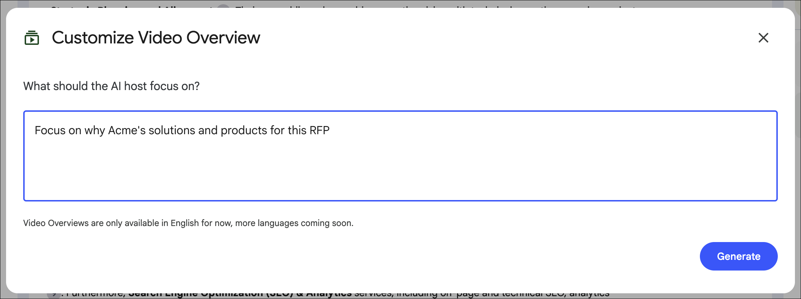

<br><br>

9. **FAQ & Notes**: Generate FAQ report and click **Save to note**.

   <br>

   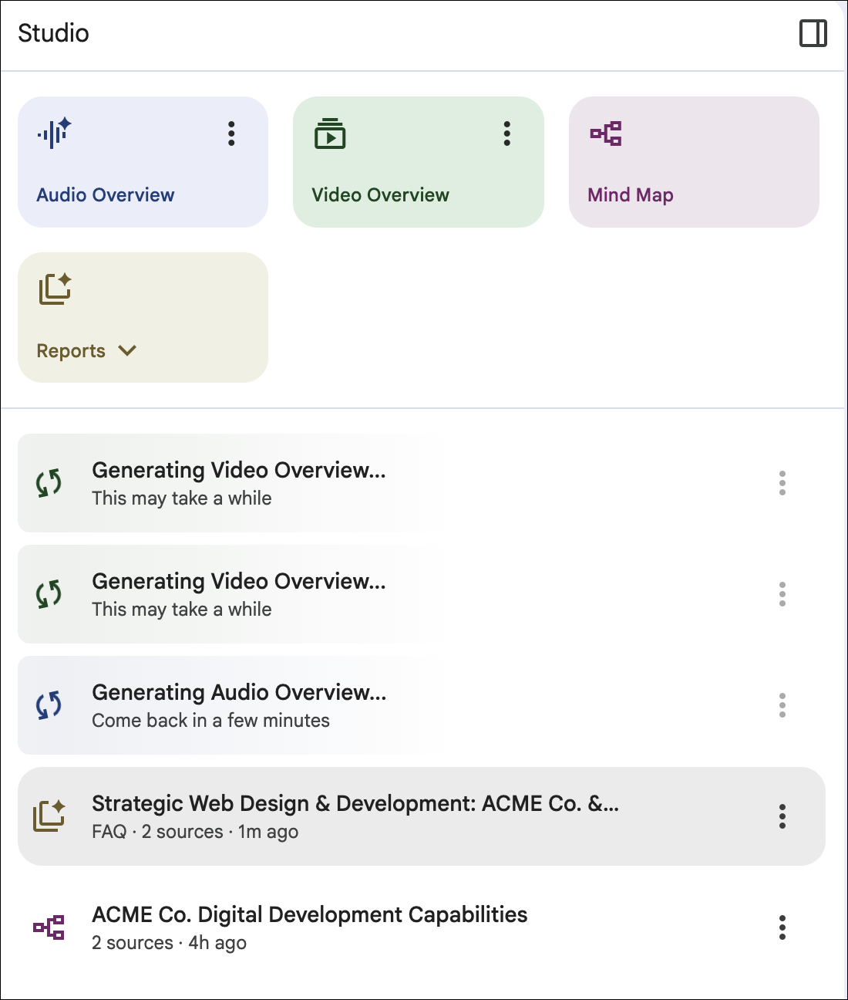

<br><br>

   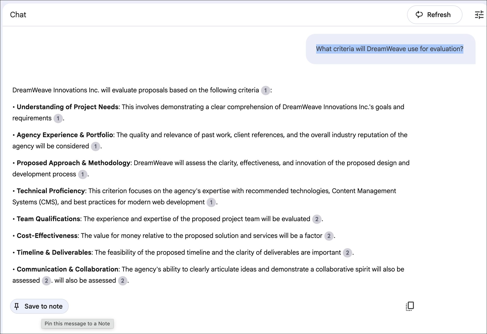

<br><br>

<div class="nav-link"><a href="#top">↑ Back to Top</a></div>

---

<div id='section-11'></div>

# Task 10: Build an Agent from a Prompt with Agent Designer

> [!NOTE]
> **Standard Edition Quota Note**: Creating and publishing custom agents draws from IHG's shared project pool of **1 agent created per user per day**.

1. Sidebar → **Agents** → **+ New agent**.

   <br>

   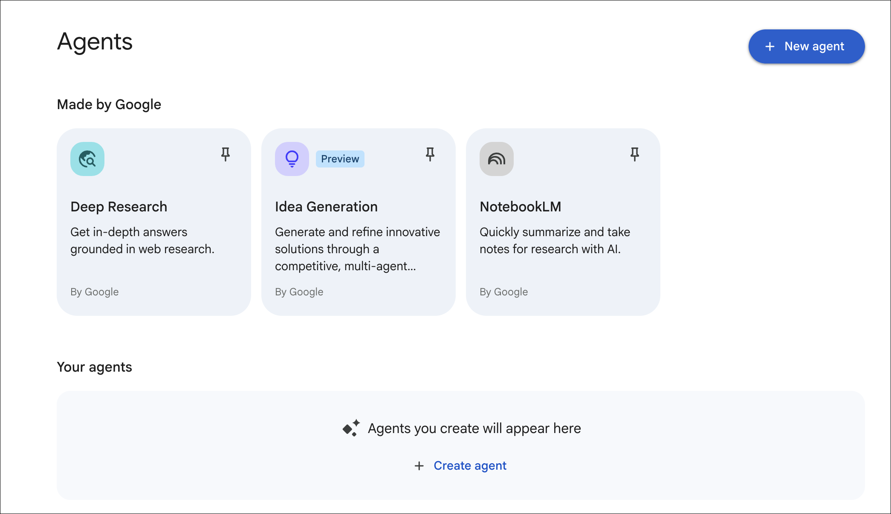

<br><br>

2. Prompt input: `Use Google Search to prepare a daily briefing on hospitality industry trends, hotel technology innovations, and competitor loyalty updates. Present as bulleted list with bold key phrases.`

   <br>

   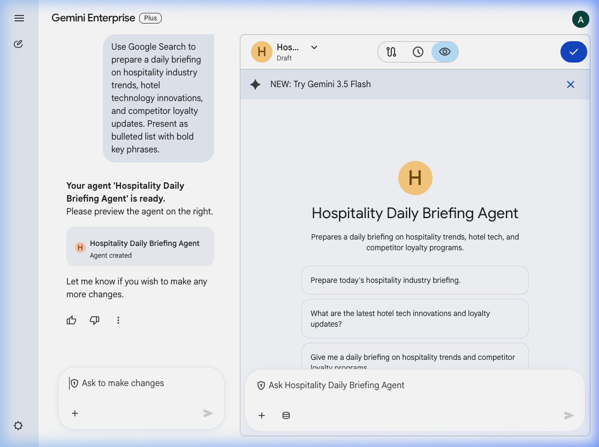

<br><br>

3. Click submit → Explore preview card (Flow, Schedule, Preview).

   <br>

   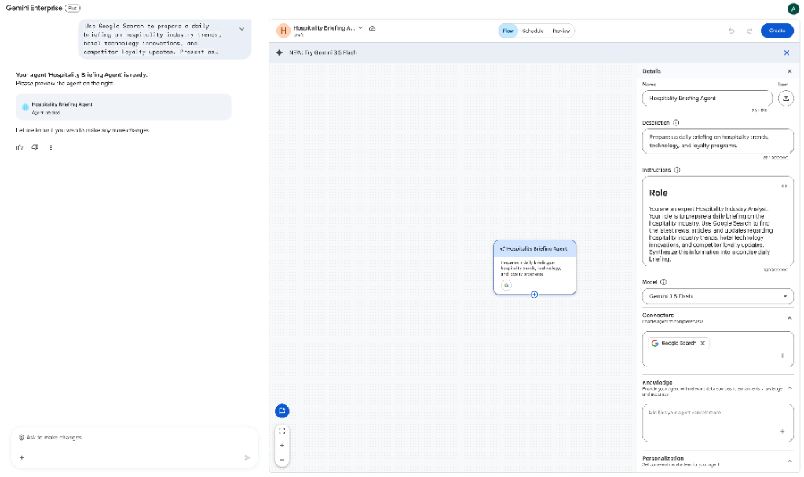

<br><br>

4. Click **Schedule** → **+ Add schedule** (Daily, 08:00 AM).

   <br>

   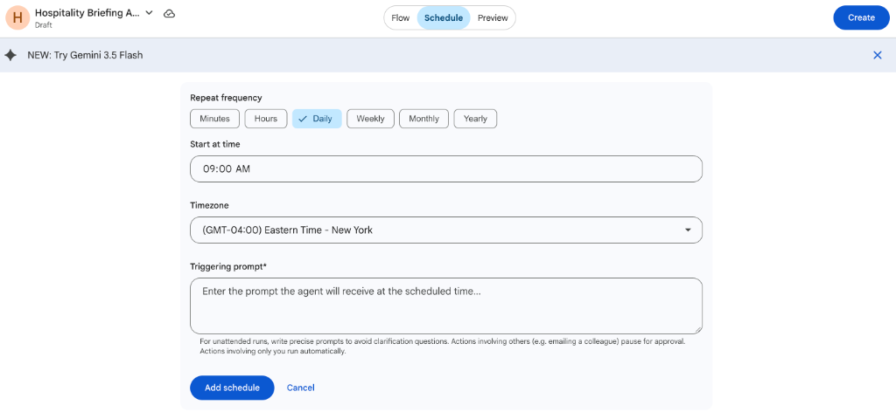

<br><br>

5. Click **Create** to deploy your scheduled daily briefing agent.

<br><br>

<div class="nav-link"><a href="#top">↑ Back to Top</a></div>

---

<div id='section-12'></div>

# Task 11: Build an Agent with the Agent Designer Builder (Multi-Step Subagents)

Build a multi-step workflow agent for IHG Event Sales & Hotel Booking Follow-up (repurposing the sales follow-up pattern).

1. Sidebar → **Agents** → **+ New agent** → **Proceed to Builder**.
2. Select main node **My Agent**:
   - **Name**: `IHG Group Sales Followup Agent`
   - **Icon**: Download icon [`data/ge_sample_data_for_workshop/robot_icon.jpg`](data/ge_sample_data_for_workshop/robot_icon.jpg)
   - **Description**: `Automates follow-up and discovery for corporate group hotel bookings and event sales calls.`
   - **Instructions**:
```text
When presented with notes from a corporate group sales inquiry or event call:
1. Write a 2-sentence thank you note expressing excitement to host their event at IHG.
2. Summarize room nights, catering, and event space requirements.
3. Transfer to the Followup Discovery subagent.
```

   <br>

   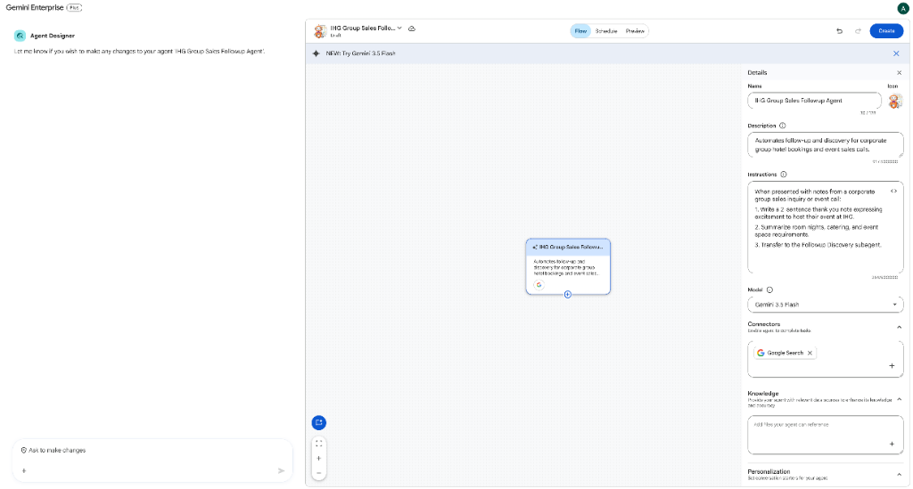

<br><br>

3. **Add Subagent**:
   - Hover over agent node → Click **+** to add subagent node.

   <br>

   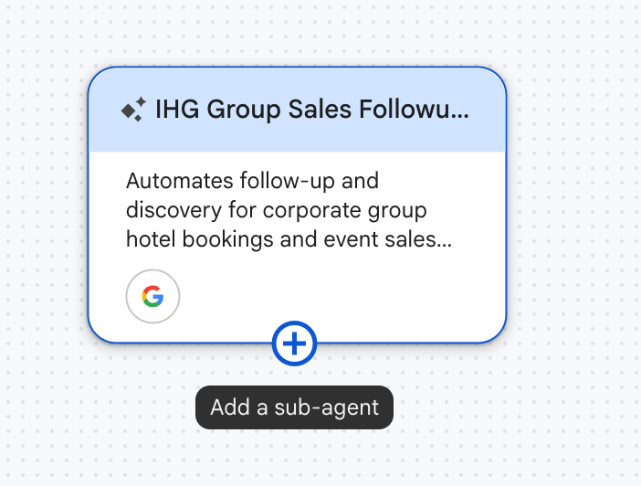

<br><br>

   - **Name**: `Followup Discovery & Amenity Planning`
   - **Description**: `Generates specific discovery questions for catering, AV, and VIP amenities.`
   - **Instructions**:
```text
Develop a list of 5 discovery questions to clarify group catering preferences, AV requirements, airport shuttle logistics, and IHG One Rewards bonus point distribution for meeting planners.
```

4. Click **Create** (upper right).
5. **Test Agent**: Click **Chat with Agent** and enter test notes:
```text
Grand Horizon Conference Inquiry Notes:
- Client needs 150 guest rooms for 3 nights at InterContinental Miami.
- Requires main ballroom for general session plus 4 breakout rooms.
- Banquet dinner for 200 guests on Night 2.
- Requested airport transportation details for executive VIPs.
```

   <br>

   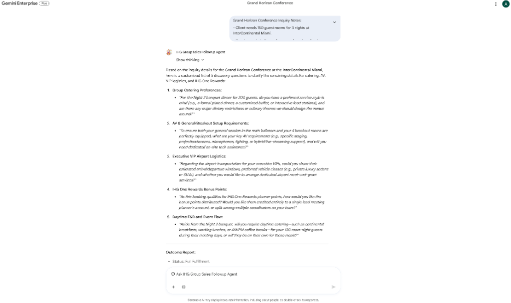

<br><br>

6. Observe how the main agent formats the thank you note and event summary, then delegates to the subagent for discovery questions!
7. **Pin Agent**: Click **...** on agent card → **Pin** to sidebar for quick access.

   <br>

   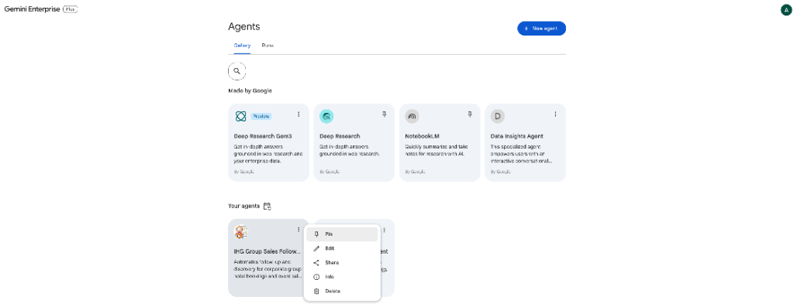

<br><br>

<div class="nav-link"><a href="#top">↑ Back to Top</a></div>

---

<div id='section-13'></div>

# Task 12: Review Submitted Tasks

- Check completed **Deep Research** report output.
- Check generated **NotebookLM Audio and Video Overviews**.
- Review scheduled run results for your **Daily Hospitality Briefing Agent**.

<br><br>

<div class="nav-link"><a href="#top">↑ Back to Top</a></div>

---

<div id='section-14'></div>

# Task 13: NotebookLM Challenge Labs

Select **one** of the three scenario challenges below to complete in NotebookLM:

### Challenge Lab 1: Hospitality Market Analyst Briefing
- **Scenario**: Analyze hotel industry earnings reports or IHG performance releases.
- **Data Sources Needed**:
  1. **YouTube Video**: Earnings Call Overview (`https://www.youtube.com/watch?v=mIK5-yi7a-c`)
  2. **Document**: Earnings Press Release PDF
  3. **Website**: IHG Corporate History (`https://www.ihgplc.com/en/about-us`)
- **Objectives**: Setup notebook, create company milestone timeline, extract top 3 revenue drivers, identify risk factors, generate Audio Overview for executive commute.

### Challenge Lab 2: Hotel GTM Strategy & Loyalty Synthesis (Marketing & Sales)
- **Scenario**: Synthesize marketing campaign data, hotel sales performance metrics, and guest customer feedback.
- **Data Source Files Location**: All source files are located in your repository folder:
  - 📄 [`data/ge_sample_data_for_workshop/xyz-sales-company/notebooklm/MARKETING_data.txt`](data/ge_sample_data_for_workshop/xyz-sales-company/notebooklm/MARKETING_data.txt)
  - 📄 [`data/ge_sample_data_for_workshop/xyz-sales-company/notebooklm/SALES_data.txt`](data/ge_sample_data_for_workshop/xyz-sales-company/notebooklm/SALES_data.txt)
  - 📄 [`data/ge_sample_data_for_workshop/xyz-sales-company/notebooklm/customer_feedback.txt`](data/ge_sample_data_for_workshop/xyz-sales-company/notebooklm/customer_feedback.txt)
- **Objectives**:
  1. **Workspace Setup**: Create a new notebook named "IHG GTM Strategy" and upload all three text files listed above.
  2. **Cross-Department Synthesis**: Identify three specific areas where marketing campaigns directly influenced hotel bookings according to the data.
  3. **Sentiment Analysis**: Summarize the top three recurring customer feedback themes.
  4. **Strategy Memo Generation**: Generate a concise "Next Quarter Strategy Memo" for the GTM Director.
  5. **Team Briefing Video**: Generate a Video Overview to share with the broader hotel commercial team.

### Challenge Lab 3: Eco-Friendly Hospitality & Sustainability Research
- **Scenario**: Research single-use plastic reduction and sustainable hotel operations across IHG properties.
- **Data Sources Needed**: Use NotebookLM **Discover Sources** feature to aggregate 3 environmental studies on sustainable tourism.
- **Objectives**: Grounded correlation of ROI & carbon footprint reduction, 3-point sustainability action plan, audio overview discussion.

---

# 🎉 Congratulations!

You have completed the **Gemini Enterprise Hands-on Lab for IHG**.

**Key Accomplishments Today:**
- Mastered foundational chat, prompt engineering, and localized translation.
- Leveraged Web Search and enterprise data store connectors.
- Analyzed PDFs, exported tabular data, and generated charts from CSVs.
- Grounded multi-modal research using NotebookLM (inline citations, Audio/Video overviews).
- Created prompt-based scheduled agents and multi-step subagent workflows in Agent Designer.
